# Installation Guide

This guide walks a ThreatConnect administrator through installing an API
Service App built from this template, from its packaged `.tcx` file to a
running service with a URL analysts can open.

Replace **Service Template** with your app's display name and
`service_template` with your API path throughout — the flow is identical.

The process has two parts:

1. **Install the app** — upload the `.tcx` package into TC Exchange.
2. **Deploy the service** — create and start an API Service instance of the
   app, then open its URL to confirm it is running.

Both parts are done entirely in the ThreatConnect web UI; no server or
command-line access is required.

> The screenshots below were captured while installing a different app built
> from this same template, so the app name and version in them will not match
> yours. Every button, field and step is the same.

## 1. Prerequisites

| Requirement | Detail |
|-------------|--------|
| **ThreatConnect version** | **7.2.0 or later** (the `minServerVersion` in `install.json`). |
| **Administrator access** | Permission to install apps via **TC Exchange Settings** and to create services under **Automation & Feeds ▸ Services**. Typically a System Administrator. |
| **The app package** | The `.tcx` file produced by `tcex package` (see [build-and-package.md](build-and-package.md)). |
| **(Optional) App parameters** | Any service-config inputs your app declares in `app_spec.yml`. The template ships with none. |

## 2. Get the app package (`.tcx`)

The app ships as a single ThreatConnect app-exchange package with a `.tcx`
extension, produced by `tcex package` into `target/`. Save it somewhere you can
browse to from your workstation. Do not unzip it — ThreatConnect reads the
package as-is.

## 3. Install the app into TC Exchange

### 3.1 Open TC Exchange Settings

Click the **Settings** (gear) icon in the top-right of the ThreatConnect
header **(1)**, then choose **TC Exchange Settings** **(2)**.

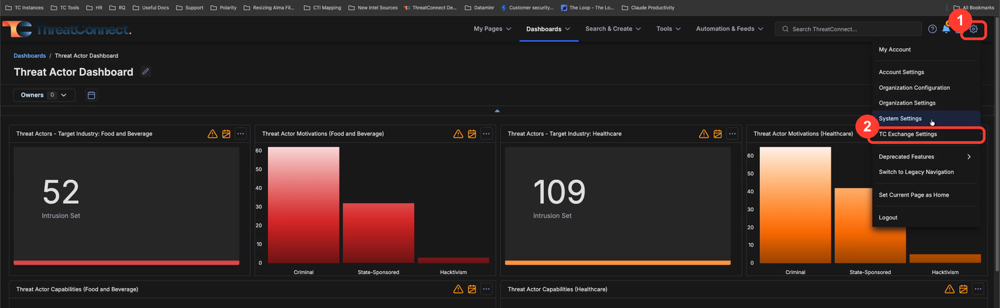

### 3.2 Start a new install

On the **Installed** tab **(1)**, click **+ Add New** **(2)** in the top-right.

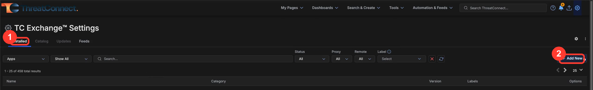

### 3.3 Open the upload dialog

The **Install a new file** panel opens. Click the **"Drag and drop, or click
to select a file"** drop zone (or drag the `.tcx` onto it).

> Packages must be a zip-format file with a `.zip`, `.tcx`, `.tcf`, `.wf`,
> `.tcxp`, or `.pbx` extension, up to 150 MB, and must include an
> `install.json` configuration file. A `tcex package` output already meets all
> of these.

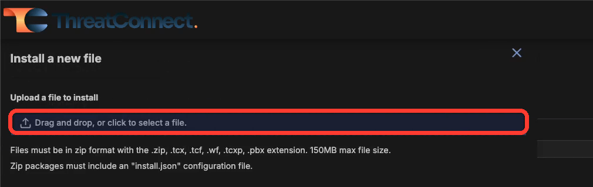

### 3.4 Choose the `.tcx` file

In the file picker, select your package **(1)** and click **Open** **(2)**.

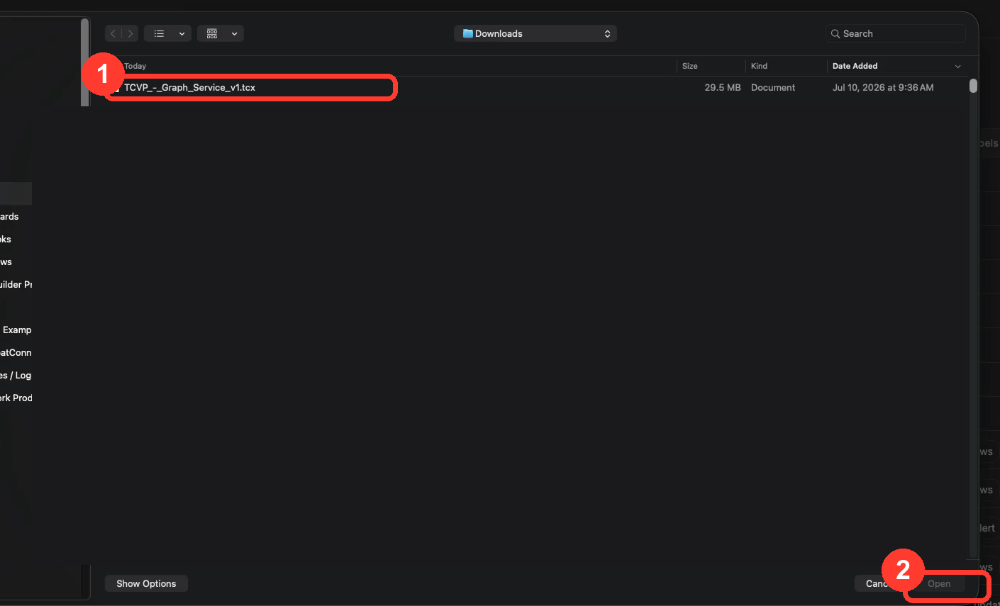

### 3.5 Confirm and install

ThreatConnect validates the package and shows what will be installed: your
app's display name, type **ApiService**, and its version. Click **+ Install**
**(1)**.

Note the warning **(2)**: *"App Services will be automatically restarted after
an upgrade. This may impact active requests on these services during
restarts."* This only matters when upgrading an already-running copy; a
first-time install has nothing to restart. Optionally tick **Allow all
organizations** to make the app available org-wide.

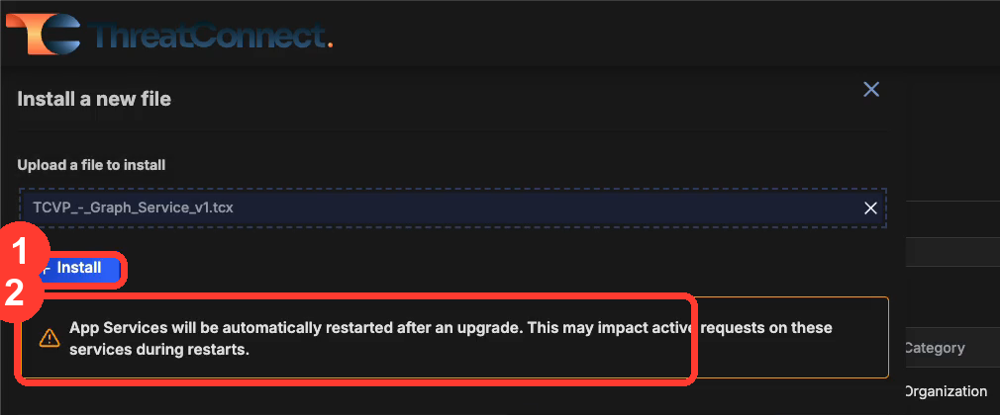

### 3.6 Installation complete

A green confirmation appears. The app is now in your TC Exchange catalog and
ready to deploy as a service.

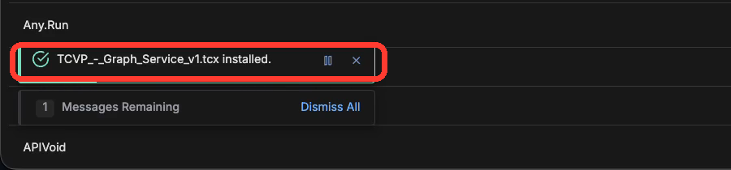

## 4. Deploy the service

Installing the app makes it available; you still need to run it as an API
service.

### 4.1 Open Services and create a new one

From the top navigation, open **Automation & Feeds** **(1)** and go to
**Services** **(2)** in the left sidebar. Then click **+ Create New Service**
**(3)** in the top-right.

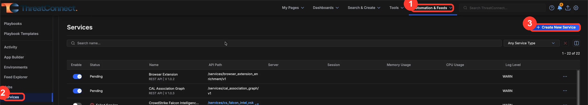

### 4.2 Step 1 — Select

In the **Add Service** panel:

- **Name** — a name for this service instance.
- **Type** **(1)** — choose **Service API**. The app appears under no other
  type.
- **Service** **(2)** — choose your app and version.

Click **Next**.

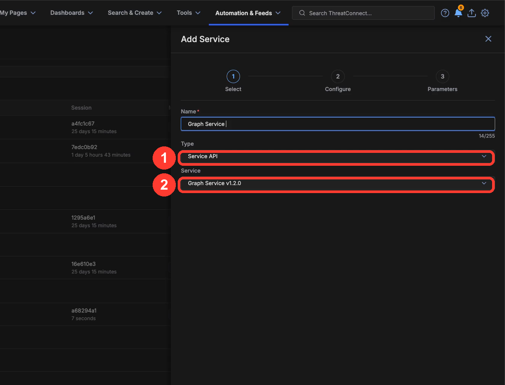

### 4.3 Step 2 — Configure

- **Launch Server** — leave the default (e.g. `tc-job`).
- **Permissions** — choose which owners can use the service, or tick **Allow
  All**.
- **API Path** **(1)** — this becomes part of the app's URL and **must be
  unique across the instance**. Enter something short, e.g. `service_template`.
  (If the path is taken, see Troubleshooting.)
- **Enable Notifications**, **Email Address**, and **Max restart attempts on
  failure** are optional; the defaults are fine.

Click **Next**.

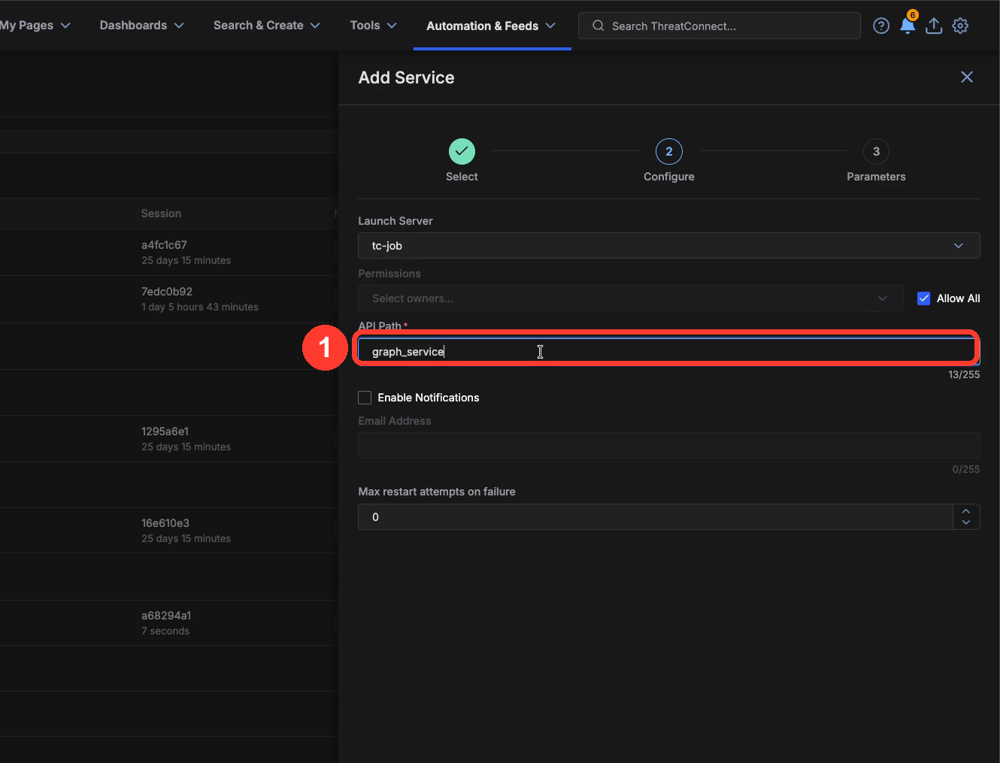

### 4.4 Step 3 — Parameters

These are the app's service-config inputs — whatever your `app_spec.yml`
declares under `sections`. An app built straight from the template declares
none, so this step is empty; click **Save**.

If you added parameters, document each one here with its type, default and
effect. Keep every input optional with a sensible default where you can: a
required input that an admin leaves blank stops the service from starting.

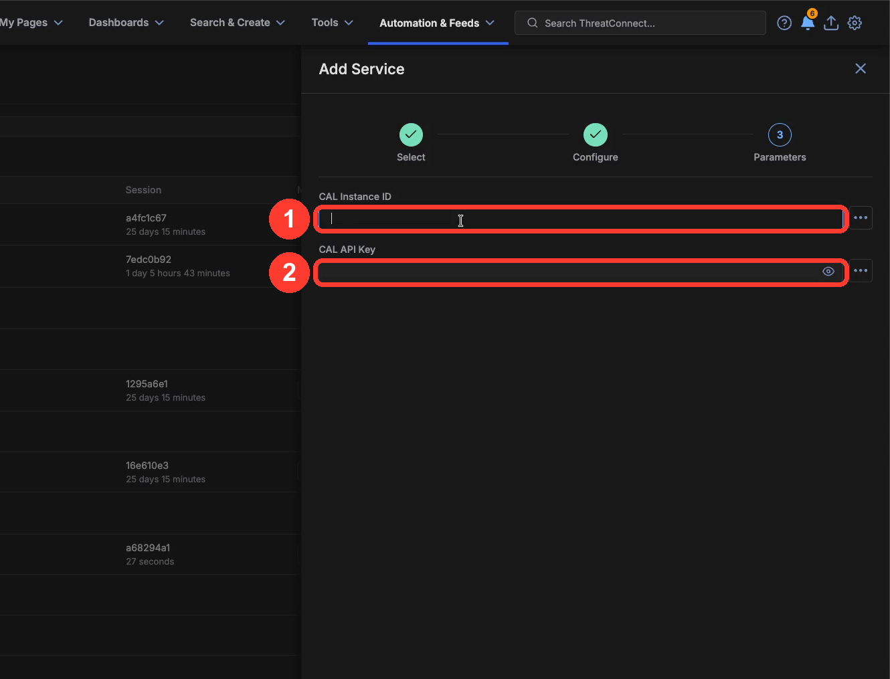

### 4.5 Wait for the service to start

The new service appears in the list. Its **Status** moves from **Pending** to
**Running** **(1)** within a few seconds. Once it is **Running**, click the
**launch icon** next to its **API Path** **(2)** (tooltip: *View Details*) to
open the app.

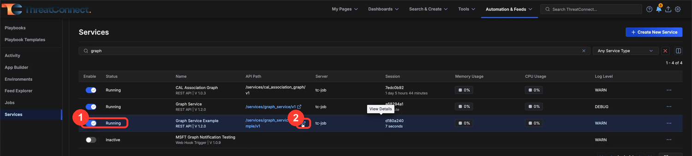

## 5. Verify the installation

The UI opens in a new tab at a URL of the form
`…/api/services/<your-api-path>/v1/#/`. You should see the app header with its
name and version, and the default page.

Note the `#/` — the SPA is hash-routed on purpose. A link without it will not
survive a reload.

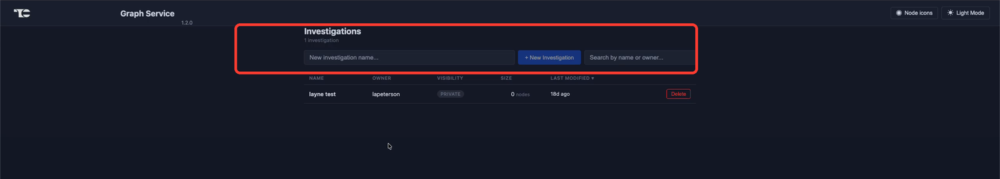

The OpenAPI/Swagger page for the app's own endpoints is at
`…/api/services/<your-api-path>/v1/apidoc/swagger`.

## 6. Troubleshooting

**"An Api service with this path already exists."**
The **API Path** you chose (section 4.3) is already used by another service.
Click **Previous**, change it to something unique, and save again.

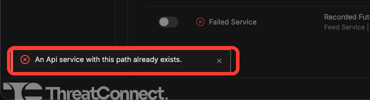

**Upload is rejected.**
Confirm the file is the unmodified `.tcx` package (a valid zip containing
`install.json`) and is under the 150 MB limit.

**The app isn't in the Service list when creating a service.**
Make sure the install from section 3 completed (you saw the green
confirmation) and that you selected **Service API** as the **Type**.

**The service won't leave Pending / shows Failed.**
Confirm the instance is on **7.2.0 or later**, then use the service's **⋯**
menu to view its logs. The most common causes are a missing `deps/` directory
in the package and a UI that was never built (the app hard-exits at boot with
*"UI files not found. Ensure they are built."*).

**The page loads blank / white.**
Almost always a routing problem: either a link used a path-style URL for a
route that is not listed in `App.spa_route_prefixes`, or the SPA was built
without `<base href="./">`. Open the browser console — a request for
`…/main-XXXX.js` answered with HTML is the signature.

**An upgrade seems to have changed nothing.**
`index.html` is not cache-busted, so a browser tab left open on the old
version keeps running the old bundle. Hard-reload before investigating a
feature that "isn't there".

## 7. Back up your app data

Data your app persists — anything written through `safe_datastore` — lives on
the service's own container disk under `{tc_out_path}/app-data/`, namespaced
per ThreatConnect organization. Two consequences worth planning for:

- Storage is **per service instance**. Two instances of the same app do not
  share it.
- Storage lives on **container disk**. It survives ordinary restarts, but any
  operation that discards the container's volume (tearing down and recreating
  the service rather than restarting it) discards the data with it.

The app exposes `GET /api/storage/export` and `POST /api/storage/import` for
taking a portable JSON backup of an organization's data and restoring it. See
the main [README](../README.md) for request details.

Two rules to know before you rely on it:

- A restore **always writes into the calling user's organization**. The
  bundle's own `orgKey` is informational; it is never used to choose where
  records land.
- Exports include secrets in plain text by default (pass `redactSecrets=true`
  to strip them, once `registry.redact_record` is implemented). Treat export
  files as sensitive.

The app also writes `app-data/.boot-marker.json` with a `bootCount` that
increments on every start. A count that keeps growing across restarts is your
proof that the volume actually persists; one that resets to 1 means it did
not.
